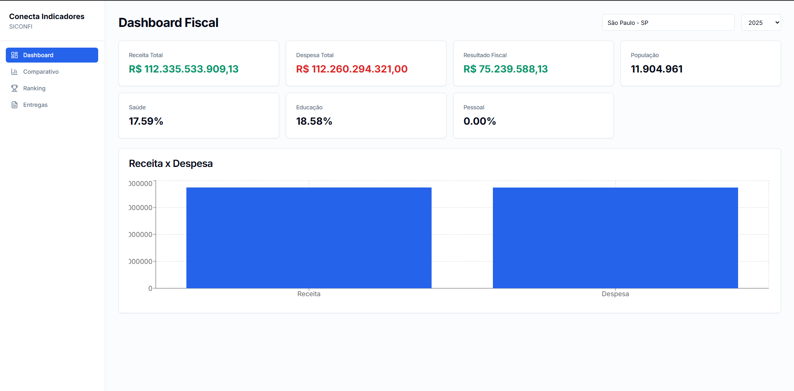

<picture>
  <source media="(prefers-color-scheme: dark)" srcset="web/public/img/image.png">
  <source media="(prefers-color-scheme: light)" srcset="web/public/img/image.png">
  
</picture>

# Conecta Indicadores

Visualização e monitoramento de indicadores fiscais dos municípios brasileiros, com dados oficiais da API SICONFI do Tesouro Nacional.

## Funcionalidades

- **Dashboard Fiscal** — Receita, Despesa, Resultado, Saúde, Educação e Pessoal de qualquer município, com gráfico Receita x Despesa
- **Comparativo Municipal** — Compare dois municípios lado a lado com diferenças percentuais automáticas
- **Ranking** — Classificação dos municípios por score fiscal, com filtro por UF e paginação
- **Entregas SICONFI** — Histórico de envio de relatórios (RREO, RGF, DCA) com status e filtros

## Stack

| Camada | Tecnologia |
|---|---|
| Frontend | Next.js 14, React 18, TypeScript, Tailwind CSS, Recharts |
| Backend | NestJS 11, TypeScript |
| Banco | PostgreSQL 16 via Prisma ORM |
| Infra | Docker Compose |

## Dados

Todas as informações são obtidas da [API SICONFI](https://apidatalake.tesouro.gov.br/ords/siconfi/tt) (Sistema de Informações Contábeis e Fiscais do Setor Público Brasileiro):

- **RREO** — Relatório Resumido da Execução Orçamentária (receitas, despesas, saúde, educação)
- **RGF** — Relatório de Gestão Fiscal (despesa com pessoal, limites da LRF)
- **Entes** — Cadastro de municípios (população, UF, CNPJ)

Os dados são sincronizados automaticamente via cron diário (02:00), respeitando o limite de 1 requisição/segundo da API do Tesouro.

## Como rodar

```bash
docker compose up --build
```

| Serviço | Porta |
|---|---|
| Web (Next.js) | [localhost:3000](http://localhost:3000) |
| API (NestJS) | localhost:3001 |
| PostgreSQL | localhost:5432 |

Na primeira execução, o seed importa os 5.570 municípios brasileiros. Ao acessar um município no dashboard, os indicadores fiscais são buscados da API SICONFI e armazenados localmente — a primeira consulta leva alguns segundos; as seguintes são instantâneas.

## API

| Método | Rota | Descrição |
|---|---|---|
| GET | `/municipalities` | Lista todos os municípios |
| GET | `/municipalities/:ibgeCode/dashboard?year=` | Indicadores fiscais de um município |
| GET | `/comparison?municipalityA=&municipalityB=&year=` | Comparativo entre dois municípios |
| GET | `/ranking?uf=&year=&page=&limit=` | Ranking municipal por score fiscal |
| GET | `/municipalities/:ibgeCode/deliveries` | Entregas SICONFI de um município |

## Estrutura

```
├── api/              # Backend NestJS
│   ├── prisma/       # Schema + migrations + seed
│   └── src/
│       ├── common/   # PrismaModule compartilhado
│       ├── jobs/     # Cron de sincronização
│       └── modules/  # Dashboard, SICONFI, Ranking, Delivery
├── web/              # Frontend Next.js
│   ├── src/
│   │   ├── app/      # Páginas (Dashboard, Comparativo, Ranking, Entregas)
│   │   ├── components/ui/  # Componentes reutilizáveis
│   │   └── lib/      # API client, utilitários
│   └── public/       # Assets estáticos
└── docker-compose.yml
```
